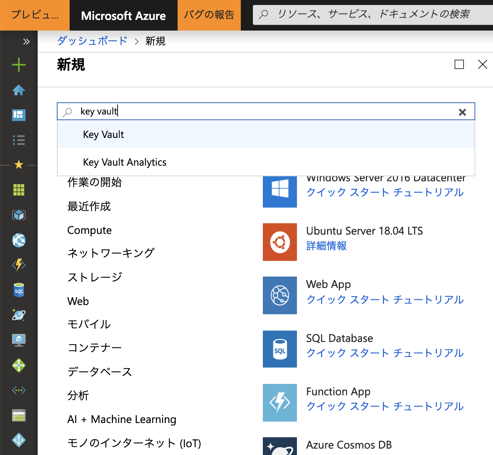
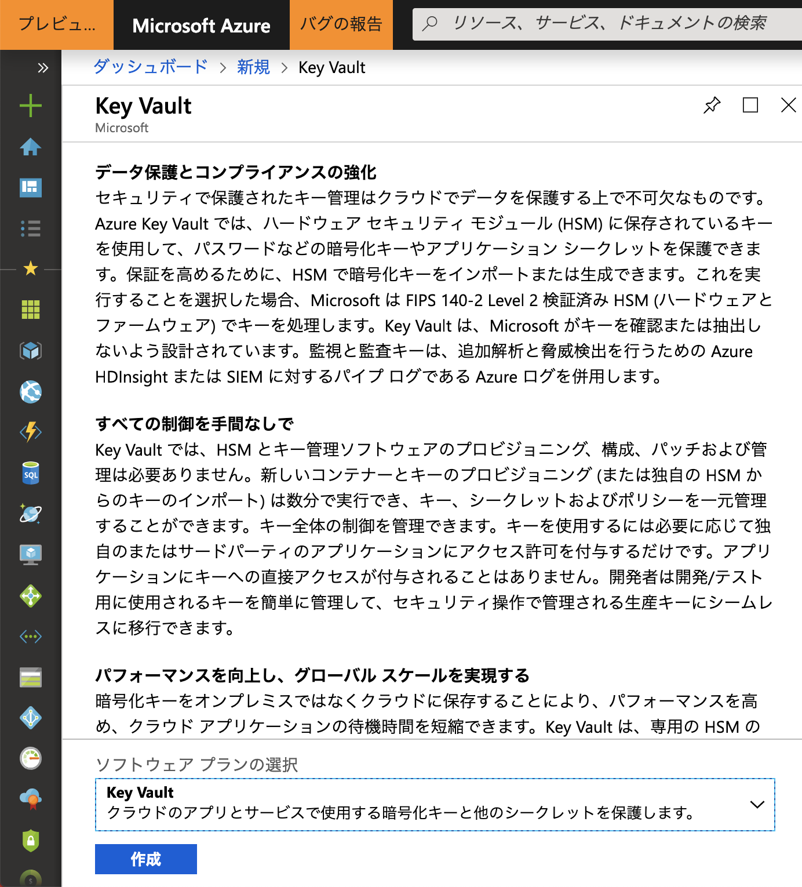
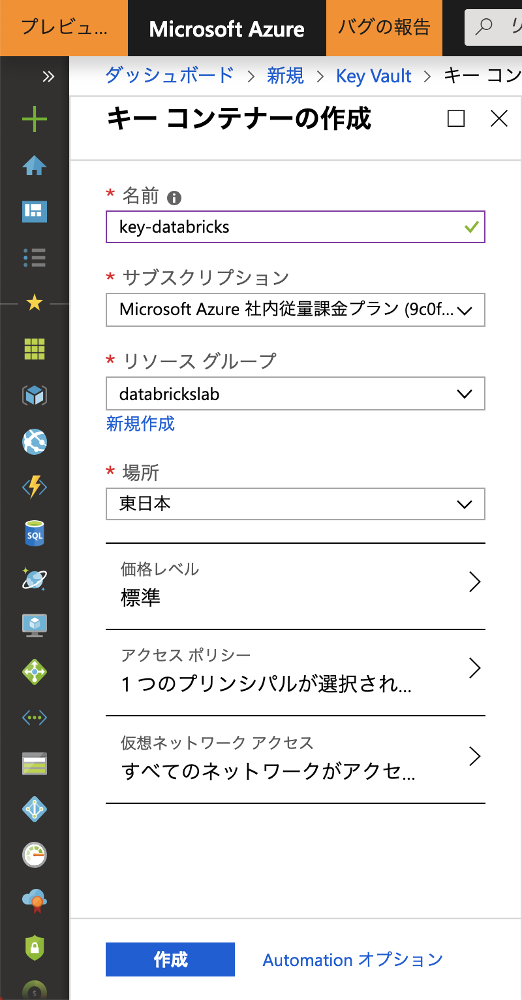
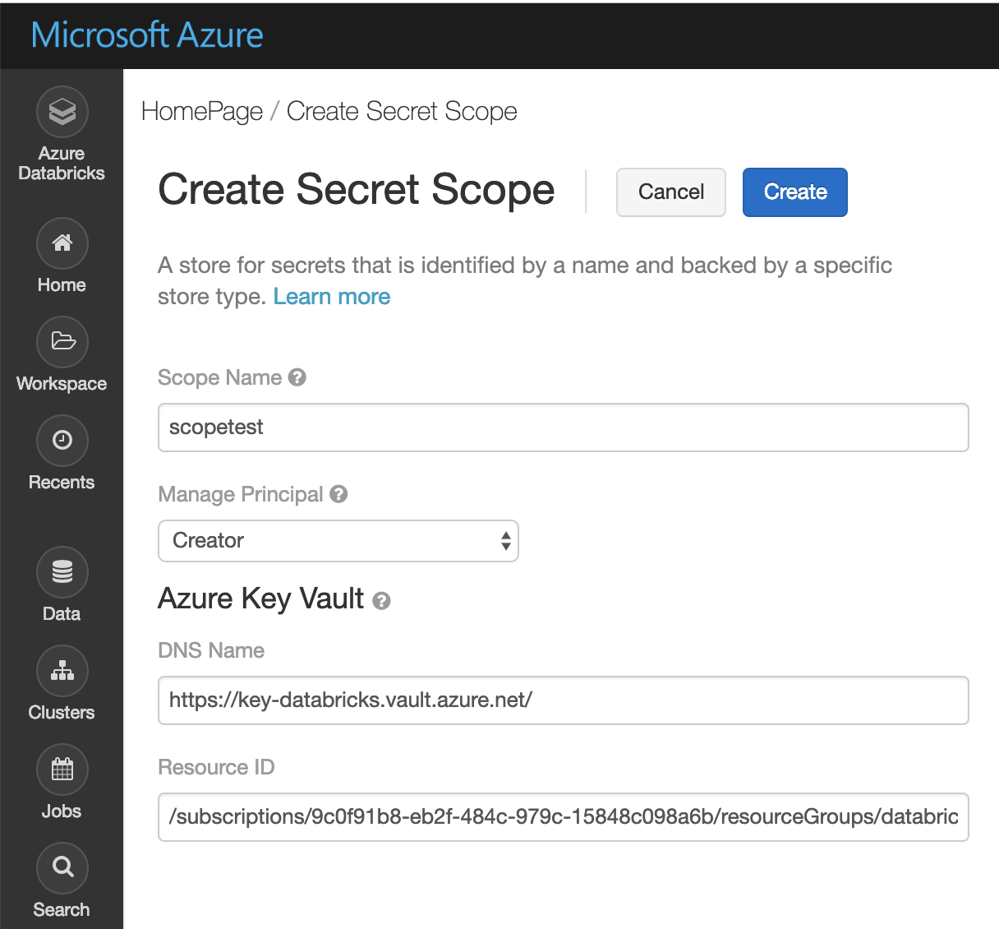

# 1. Azure Blob Storage 設定  
## 1.1 Azure KeyVault 作成
1. Azure Portal にアクセス
2. 左パネルの"リソース作成"のページから、"key vault"を検索  
  

3. 作成ボタンをクリック  
    

4. 各種情報の入力    

- 名前：任意の名前  
- サブスクリプション：ハンズオンで利用しているもの  
- リソースグループ：Databricksと同じリソースグループ（が望ましい)   
- 場所：東日本  

## 1.2 Secret 設定 
1. 下記URLにアクセスし、各種情報の入力
https://westus.azuredatabricks.net#secrets/createScope

  

- Scope Name : 任意の名前 (忘れないようにしてください)  
- Manage Pricipal : Creator 
 
**Azure Key Vault**
- DNS Name : Azure Key Vault より取得
- Resource ID : Azure Key Vault より取得

2. Azure Portal より Azure Key Vault を開く

3. ストレージのキーをSecretに登録

## 1.3 Azure Blob Storage マウント  
1. Azure Databricks のワークスペースからNotebookをオープン
2. 下記コマンドを実行

```python
dbutils.fs.mount(
  source = "wasbs://<your-container-name>@<your-storage-account-name>.blob.core.windows.net",
  mount_point = "/mnt/<mount-name>",
  extra_configs = {"<conf-key>":dbutils.secrets.get(scope = "<scope-name>", key = "<key-name>")})
```

\<your-container-name> : Blobストレージのコンテナ名  
\<your-storage-account-name> : ストレージアカウント名     
\<mount> : マウントする任意のパス  
\<conf-key> : Azure Databircksで作成したScope Name  
\<key-name> : Azure Key Vaultで登録したSecretの名前

## 1.4 Pathの確認 (DBFS, OS)

```python
# DBFSからみたファイルパス
dbutils.fs.ls("/mnt/<mount-name>")
```

```python
# OSからみたファイルパス
%sh ls -la /dbfs/mnt/<mount-name>
```

