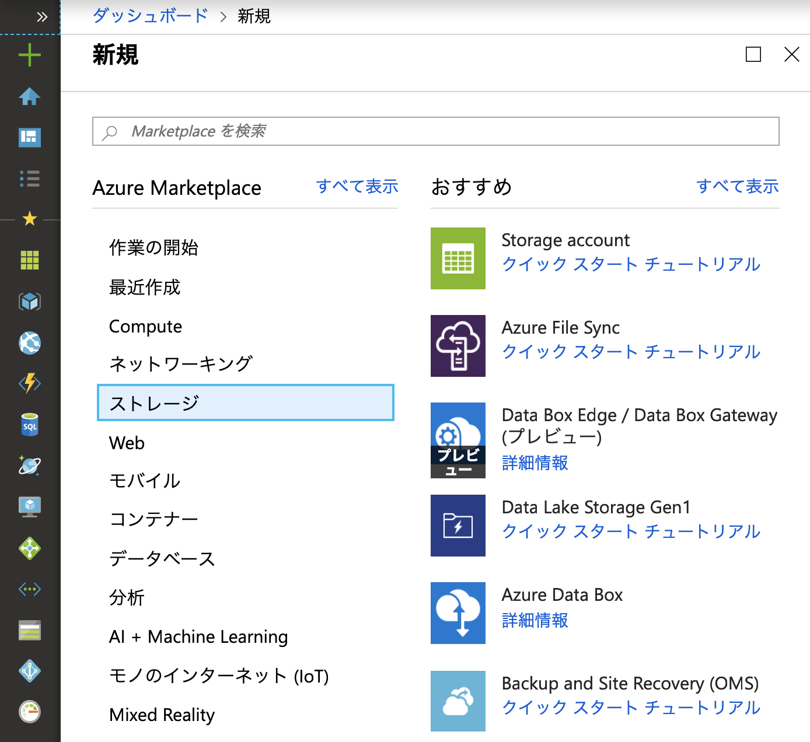

# Azure Storage Account 作成
1. Azure Portal にアクセス
2. 左パネルの"リソース作成"のページから、"storage account"を検索  
  

3. 作成ボタンをクリック
4. 各種情報の入力  
  

- サブスクリプション : ハンズオンで利用しているもの
- リソースグループ : Databricksと同じリソースグループ（が望ましい） 
- ストレージアカウント名：任意の名前
- 場所：東日本
- パフォーマンス：Standard
- アカウントの種類：StorageV2 (汎用v2)
- レプリケーション：読み取りアクセス地理冗長ストレージ (RA-GRS)
- アクセス層：ホット
最後に"作成"をクリックします。
