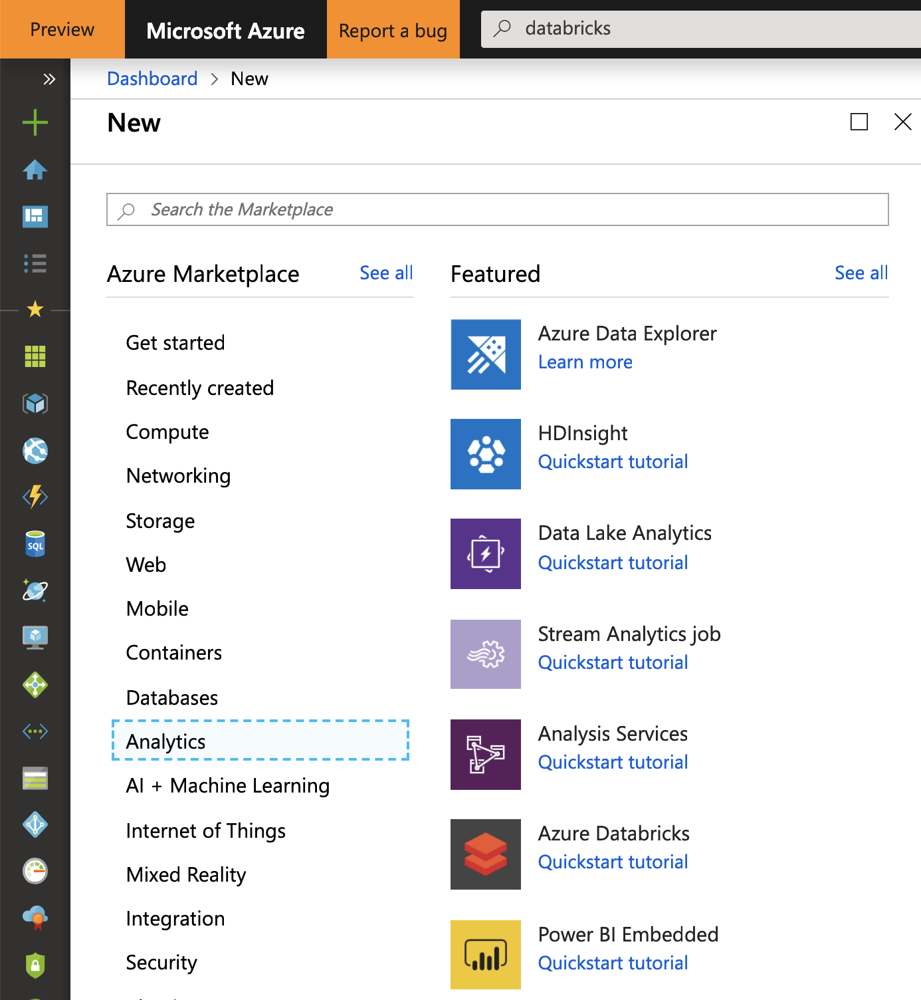
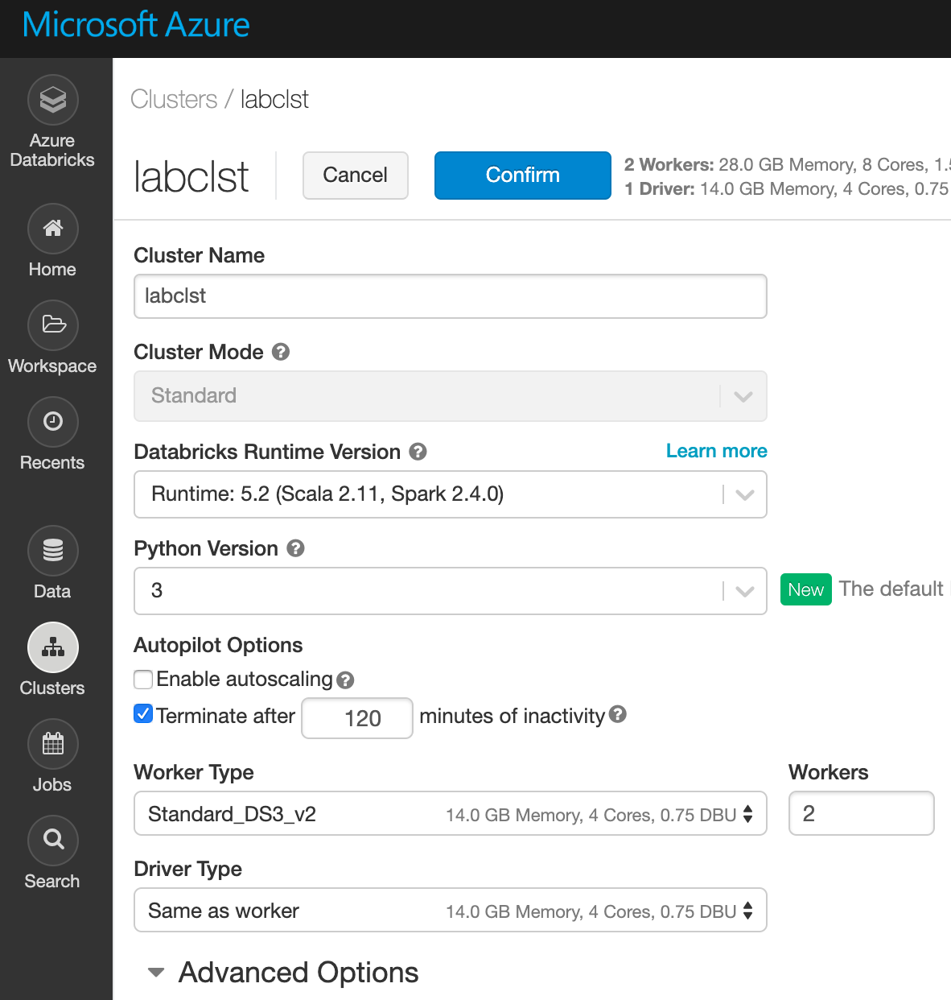

# Azure Databricks 初期設定

## 1. Azure Databricksサービス作成

1. Azure Portal にアクセス
2. 左パネルの"リソース作成"のページから、"Databricks"を検索  

  

3. 作成ボタンをクリック
4. 各種情報の入力    
  

最後に"作成"をクリックします。
5. Azure Databricks にログイン
(databricks_portaltop.png)

## 2. Cluster 環境構築  

1. Azure Databricks トップ画面

2. Clusterから、Create Clusterをクリック

3. 各種情報を入力  
  

- Cluster Name : 任意の名前
- Cluster Mode : Standard
- Databricks Runtime Version : Runtime 5.2 
- Python Version : 3
- Autopilot Options  
  Enable autoscaling : check  
  Terminate after xxx minutes of inactivity :120
- Worker Type : 任意のインスタンス  
  Min Workers : 1  
  Max Workers : 4  
- Driver Type : Same as worker

4. Create Clusterをクリック

※参考情報
- クラスターにインストールされているライブラリ情報  
Databricks Runtime 5.2  
https://docs.databricks.com/release-notes/runtime/5.2.html

## 3. Notebook インポート
1. Azure Databricks のトップ画面から Workspace を選択
2. 右上のドロップダウンリストから Import を選択
3. URL を選択し、下記URLを入力し、Import
URL : https://github.com/konabuta/databricks/blob/master/DataPrep/PySpark%20SQL%20Basic.dbc
4. "PySpark SQL Basic" という名前の Notebook があることを確認

- 詳細手順 : Managing Notebooks - Import a notebook  
https://docs.azuredatabricks.net/user-guide/notebooks/notebook-manage.html#import-an-archive
