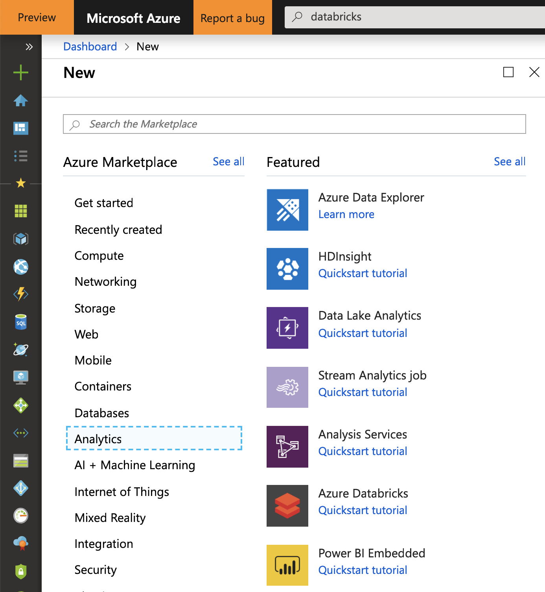
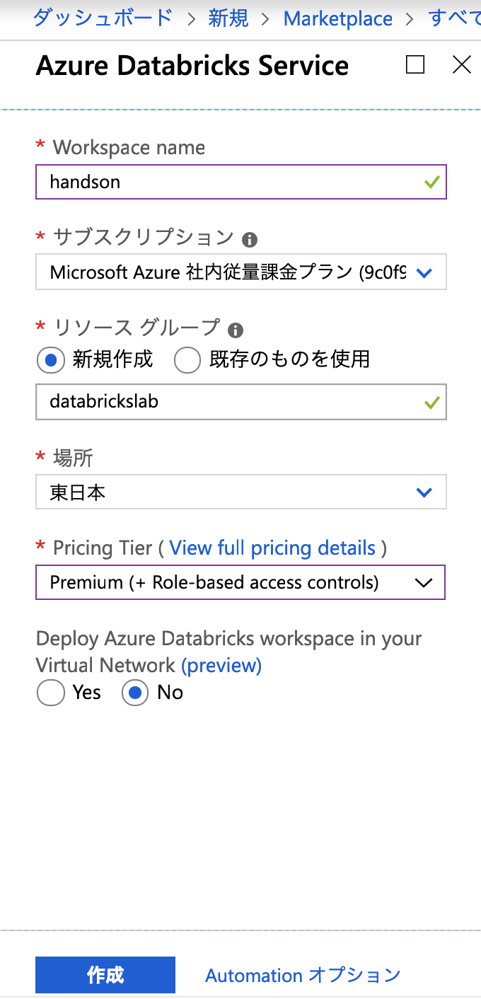
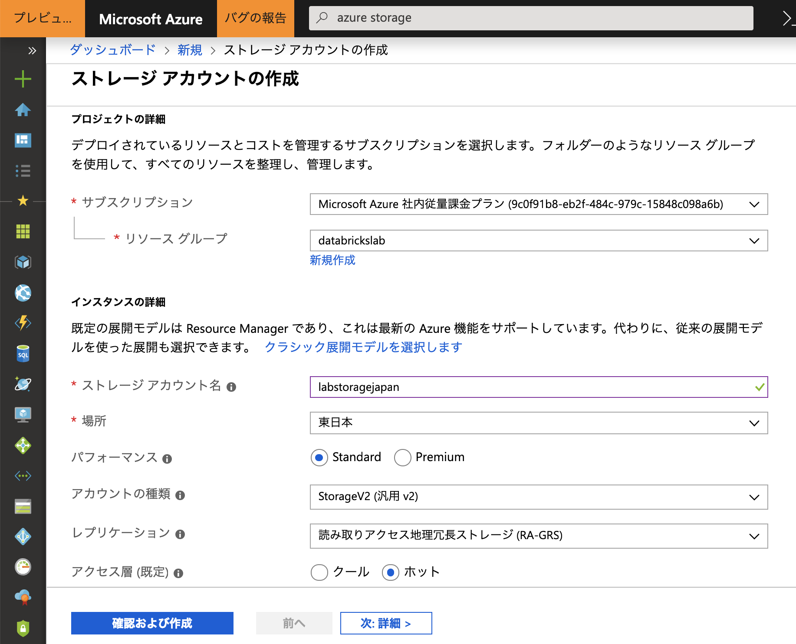
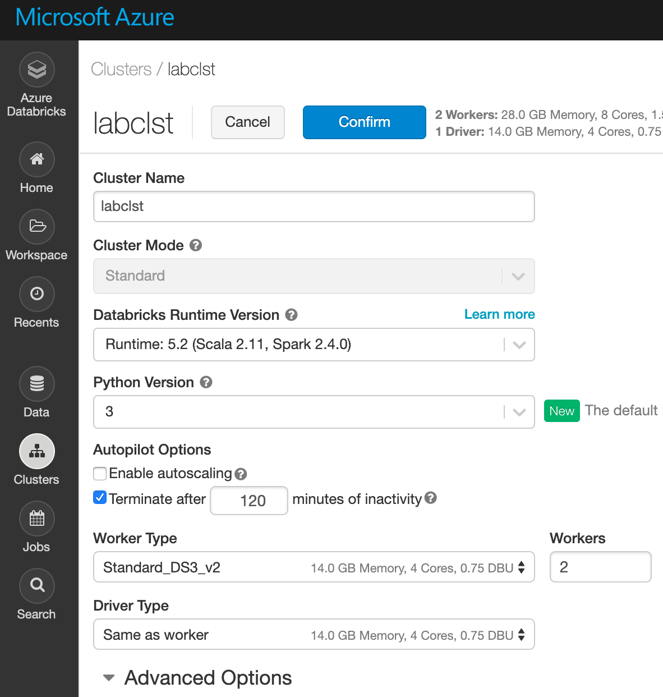

# 0. Azure Databricks 初期設定

## 1. Azure Databricksサービス作成

1. Azure Portal にアクセス
2. 左パネルの"リソース作成"のページから、"Databricks"を検索  

  

3. 作成ボタンをクリック
4. 各種情報の入力    
  

最後に"作成"をクリックします。
5. Azure Databricks にログイン
(databricks_portaltop.png)

## 2. Azure Storage Account 作成
1. Azure Portal にアクセス
2. 左パネルの"リソース作成"のページから、"storage account"を検索  
  

3. 作成ボタンをクリック
4. 各種情報の入力  
  

- サブスクリプション : ハンズオンで利用しているもの
- リソースグループ : Databricksと同じリソースグループ（が望ましい） 
- ストレージアカウント名：任意の名前
- 場所：東日本
- パフォーマンス：Standard
- アカウントの種類：StorageV2 (汎用v2)
- レプリケーション：読み取りアクセス地理冗長ストレージ (RA-GRS)
- アクセス層：ホット
最後に"作成"をクリックします。

## 3. Cluster 環境構築  

1. Azure Databricks トップ画面

2. Clusterから、Create Clusterをクリック

3. 各種情報を入力  
  

- Cluster Name : 任意の名前
- Cluster Mode : Standard
- Databricks Runtime Version : Runtime 5.2 
- Python Version : 3
- Autopilot Options  
  Enable autoscaling : _Uncheck_  
  Terminate after xxx minutes of inactivity :120
- Worker Type : 任意のインスタンス  
  Workers : 2
- Driver Type

4. Create Clusterをクリック

※参考情報
- クラスターにインストールされているライブラリ情報  
Databricks Runtime 5.2  
https://docs.databricks.com/release-notes/runtime/5.2.html

## 4. Azure SQL Database 環境構築 (オプション)

## 5. Machine Learning on Spark