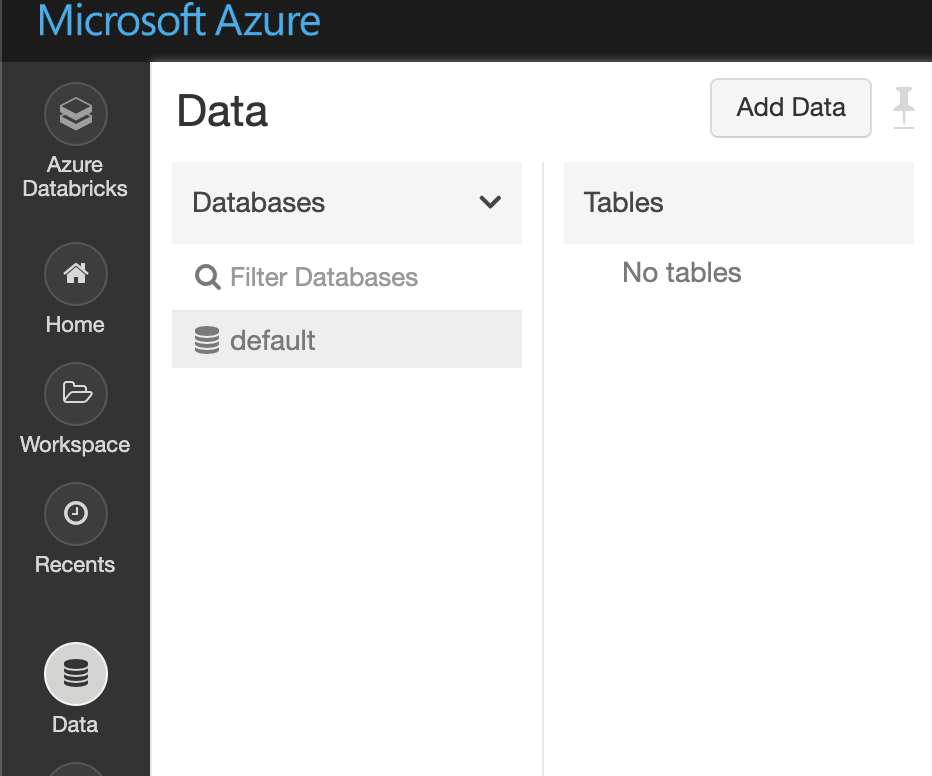
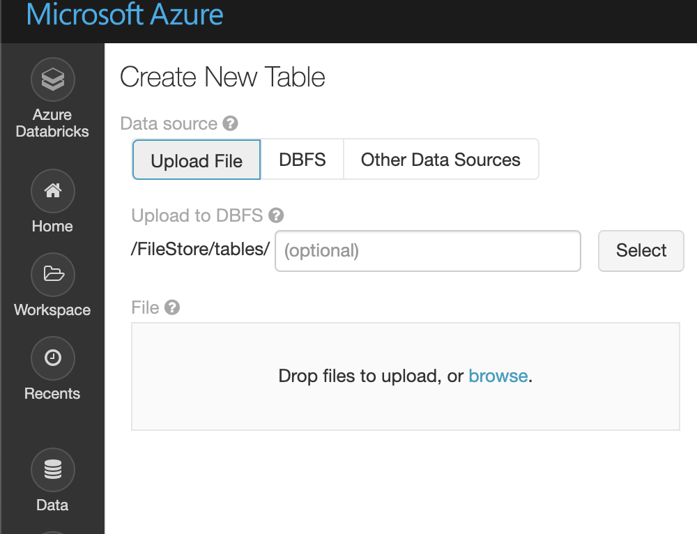
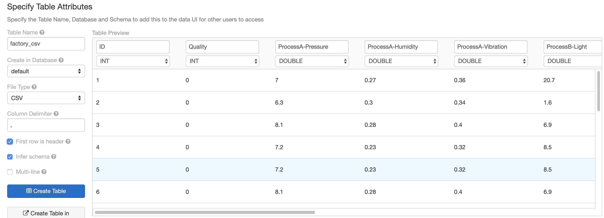

# ローカルデータのアップロード

## 1. 利用するデータ
[Factory.csv](./data/Factory.csv) 

- ある製品の製造工程におけるセンサデータの最終品の検査結果(OK/NG)が含まれるサンプルデータです。
- 自分のローカルマシンにダウンロードします。


## 2. データのアップロード
2.1 左パネルの"Data"をクリック  
2.2 "Add Data"をクリック     
   

2.3 "browse"をクリックし、Factory.csvをアップロード
   

2.4 "Create Table with UI"をクリックし、使用するクラスターを選択

2.5 "Preview Table"をクリックし、データの中身を確認

2.6 テーブル設定

First row is header : __チェック__   
Infer schema : __チェック__    
※ その他はデフォルト設定で構いません。

   

2.7 問題が無ければ、"Create Table"  

## 3. データ確認

新しくNotebookを作成し、データの中身を確認します。

```python
factory = spark.table("factory_csv")
display(factory)
```